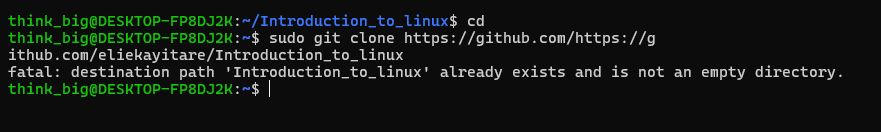
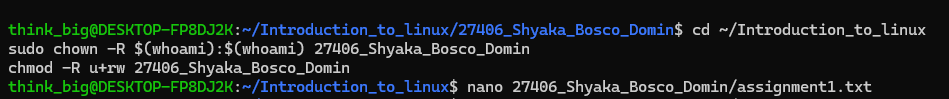
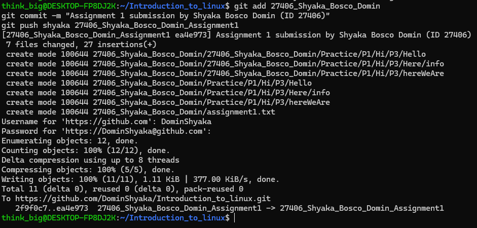
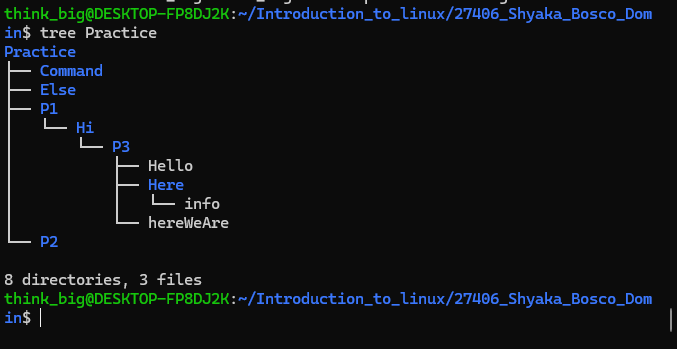
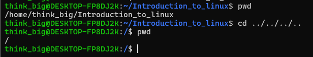

# Assignment 1 – Shyaka Bosco Domin 
#ID: 27406

This document contains my solutions and proof (with screenshots) for Assignment 1 in **Introduction to Linux**.

## 1. Cloning the Repository
I cloned the repository from GitHub into my WSL environment.

---

## 2. Preparing the Folder & Permissions
I created my personal folder `27406_Shyaka_Bosco_Domin` and fixed permissions so I could add files inside it.

---

## 3. Adding Assignment Files and Pushing
I created the `Practice` directory structure, added `assignment1.txt`, and committed my changes to branch  
`27406_Shyaka_Bosco_Domin_Assignment1`.

---

## 4. Directory Structure
Recreated the `Practice` tree exactly as required in the assignment:

Practice
├── Command
├── Else
├── P1
│ └── Hi
│ └── P3
│ ├── Hello
│ ├── hereWeAre
│ └── Here
│ └── info
└── P2

From P3 to home: 
Relative: cd ../../../.. 
Absolute: cd /home/shyaka

Long listing of Here: 
ls -l ../P1/Hi/P3/Here

Copy directory P3 into Command: 
cp -r ../P1/Hi/P3 . 
ls -R

Copy files inside 3 into Command: 
cp ../P1/Hi/P3/* . 
ls

Difference: 
Q3 copies the whole directory P3 into Command. 
Q4 copies only the files inside P3 directly into Command.

Colors: 
Blue = directories 
Yellow = files 
hereWeAre should be yellow because it is a file.

Work was completed on branch: 27406_Shyaka_Bosco_Domin_Assignment1

This completes my Assignment 1 with both written answers and visual proof.
