# Introduction_to_linux

# Assignment 2

## Student Info

- Name: Ntwari Ashimwe Fiacre
- Student ID: 27438
- Assignment: 2

---

## Q1. Which directories might an attacker modify?

From q1_answer.txt

- /etc    : system configuration files (passwd, sshd_config, cron jobs). Attackers change configs here.
- /bin    : essential binaries (shells, coreutils) which if replaced can hide activity or run malicious code.
- /usr    : userland programs; /usr/bin contains many user commands that could be swapped.
- /var    : variable data, especially /var/log (intrusion evidence) and /var/spool, /var/tmp (persistence).
- /tmp    : world-writable temp; used for uploads or transient scripts (persistence).
- /opt    : third-party optional software — often used for vendor apps; attackers may drop tools here.
- /boot   : kernel images and bootloader config; tampering here can persist across reboots.
- /home   : user files and ssh keys; attackers place backdoors or harvest credentials.

Reasoning: configuration files under /etc control services. Binaries in /bin and /usr/bin are executed by the system; replacing them provides stealth. Logs in /var/log reveal intrusion evidence; /tmp is writable and convenient for attackers; /boot alters system startup; user ssh keys and scripts live in /home.
 

---

## Q2. Create nested directories structure efficiently

From q2_answer.txt

```bash
mkdir -p ~/projects/{client_work/{projectA/{src,docs,tests},projectB/{src,docs,tests}},personal/{experiments,portfolio},shared/{templates,assets}}

# This creates:
# - ~/projects/client_work/projectA/{src,docs,tests}
# - ~/projects/client_work/projectB/{src,docs,tests}
# - ~/projects/personal/experiments
# - ~/projects/personal/portfolio
# - ~/projects/shared/templates
# - ~/projects/shared/assets
```

Screenshots:

- 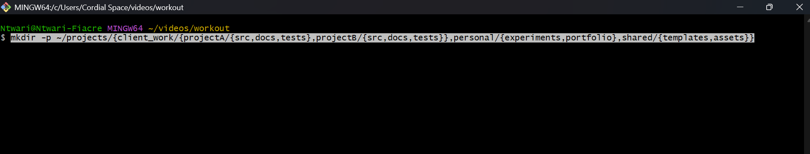

---

## Q3. Navigate without absolute paths (limit cd usage)

From q3.sh

```bash
# Starting dir was ~/projects/client_work/web/frontend
pwd       # prove starting location
cd ../../../../personal/experiments
pwd       # prove we are in ~/projects/personal/experiments
cd ../../shared/templates
pwd       # prove we are in ~/projects/shared/templates
cd ../../../client_work/web/frontend
pwd       # prove we are back to start

# Alternative using pushd/popd is also valid.
```

Screenshots:

- 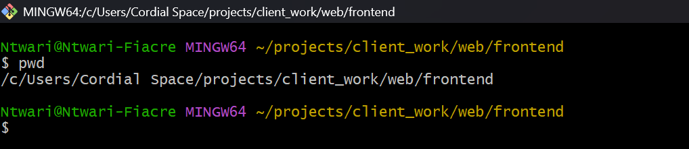
- .png)
- .png)
- .png)

---

## Q4. Generate a realistic web project structure with minimal commands

From q4.txt

The trick here is to generate the whole realistic web project structure with the fewest commands possible using brace expansion and loops.

Here’s the clean and efficient Git Bash solution:

Step 1: Create project directory

```bash
mkdir -p web_project && cd web_project
```

Step 2: Create 15 HTML files

Pattern: index.html, about.html, contact.html, page_001.html … page_012.html

```bash
touch index.html about.html contact.html page_{001..012}.html
```

Step 3: Create 8 CSS files

Names are fixed list:

```bash
touch {main,reset,theme_light,theme_dark,mobile,tablet,desktop,print}.css
```

Step 4: Create 6 JavaScript files

Requirement: names must include script, util, and config variations. Example:

```bash
touch {app_script,loader_script,ui_script,util_dom,util_helpers,config_app}.js
```

Step 5: Create 20 backup files (5 each starting with a, b, c, d with mixed extensions)

```bash
for L in a b c d; do
  touch ${L}1.bak ${L}2.old ${L}3.zip ${L}4.tar ${L}5.txt
done
```

Step 6: Verify structure

```bash
ls -1
```

Screenshots:

- 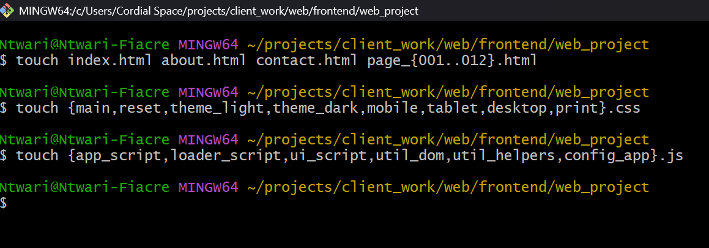
- .png)
- .png)

---

## Q5. Pattern matching and selective operations

From q5.txt

```bash
# Move files ending in numbers (before extension)
mv *[0-9].* archive/

# Copy CSS except mobile/tablet (requires extglob)
shopt -s extglob
cp !(*mobile*|*tablet*).css desktop/

# List files with 3 characters before dot
ls ???.*

# Find files starting with a consonant
ls [!aeiouAEIOU]*

# Find files with 2-char extension
ls *.[[:alpha:]][[:alpha:]]
```

Screenshots:

- 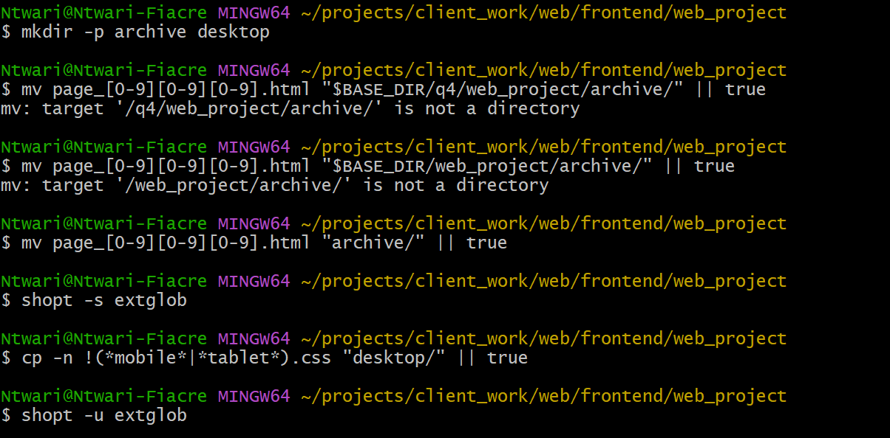
- .png)

---

## Q6. Create logs, configs, and test files efficiently

From q6.txt

```bash
# Logs (Jan, Feb, Mar 2024)
touch log_2024-01-{01..31}.txt
touch log_2024-02-{01..29}.txt
touch log_2024-03-{01..31}.txt

# Configs (3 services × 3 envs)
touch {web,api,db}.{dev,staging,production}.conf

# Test files (A–C × 10–12 × input/output)
touch {A,B,C}{10..12}.{input,output}
```

Screenshots:

- 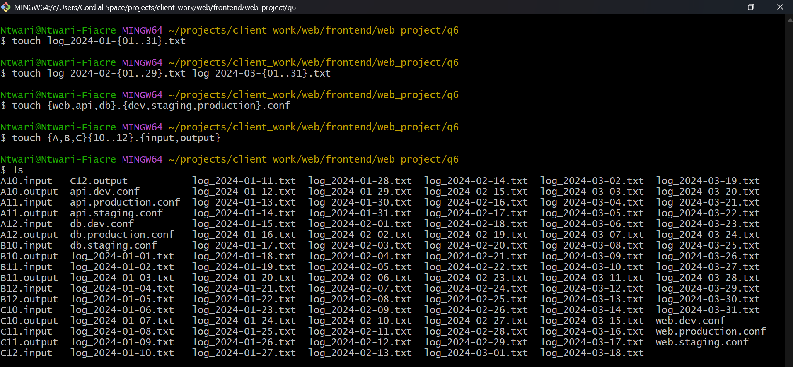
- .png)
- .png)
- .png)

---

## Q7. Why do diff/cmp/comm treat similar-looking files as different?

From q7.txt

Although both files had the same visible text, they were treated differently because of line endings.

- diff reported every line as different, since it saw `\n` vs `\r\n`.
- cmp found the first differing byte position (extra `\r` in CRLF).
- comm considered the lines different entirely, since the hidden carriage return made the strings mismatch.

Lesson: Cross-platform compatibility issues arise when files are edited across Linux and Windows. Config files or scripts may break because of incorrect line endings. The safe practice is to normalize files using tools like dos2unix, unix2dos, or Git’s core.autocrlf setting.

Screenshots:

- 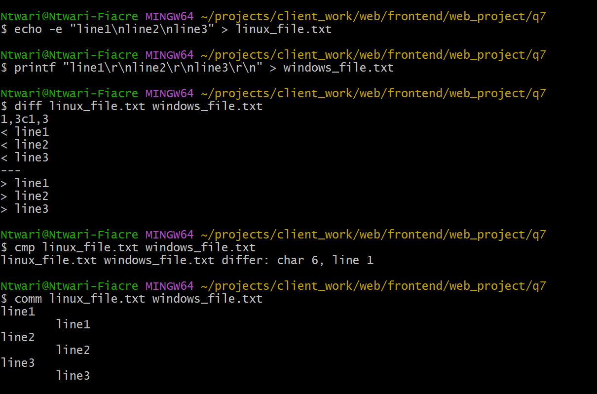

---

## Q8. File hunting rules for incident response

From q8.txt

- Larger than average size: useful to flag unusually large logs or dumps.
- Modified within last 72h but not 24h: captures files that may have been tampered with in a recent window.
- Empty/hidden-only directories: suspicious if attackers hide tools in “hidden-only” dirs.
- World-writable files: a major risk; any user can overwrite them.
- Owned by other users: can reveal files that shouldn’t belong to another account.
- Temporary/backup files: may contain sensitive data left unsecured.

Screenshots:

- 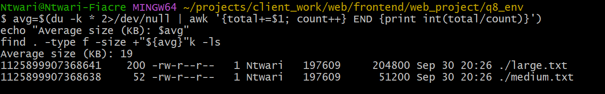
- .png)
- .png)
- .png)

---

## Q9. Practical log analysis workflow

From q9.txt

I generated a 250-line log file (biglog.txt) with periodic ERROR entries. Using sed, I extracted the middle 50 lines for focused troubleshooting. To find the last error, I used `grep -n` with `tail` to get the last match and `sed` to display 5 lines of context. I compared efficiency with `time`: `cat` reads the entire file (slower for huge files), while `less` loads pages on demand (better over SSH with limited bandwidth). For error filtering, `grep -n` allowed me to extract only relevant lines while preserving line numbers for reference. This demonstrates practical log analysis techniques and shows why `less` is superior to `cat` in remote troubleshooting.

Screenshots:

- 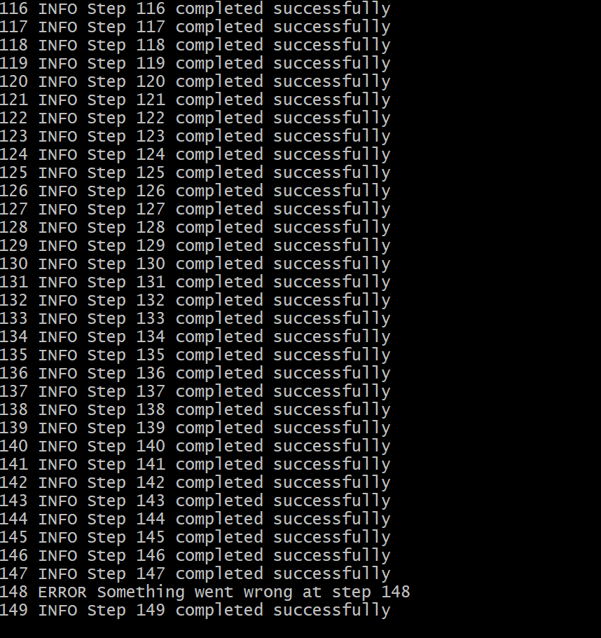
- .png)
- .png)
- .png)
- .png)

---

## Q10. Automating file maintenance with find -exec

From q10.txt

I automated file maintenance with `find -exec`. I first standardized permissions: all files to 644, but executables restored to 755. To measure storage impact, I computed disk usage of files older than 30 days with `find … | du -ch`. For configuration safety, I created .backup copies of `*.conf` files. To clean temporary files, I targeted files not accessed in 30+ days and used `-ok` for interactive safety before removal. I previewed dangerous operations with `-print` and `-ls` to confirm the target set before execution. This shows how to combine `find` with actions for safe system maintenance.

Screenshots:

- 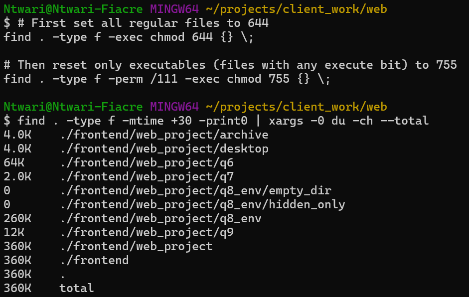
- .png)
- .png)

---

## Q11. Storage space compression analysis

From q11_and_q12.txt (Question 11 section)

What I Did: I created two directories, one containing already compressed files (jpg, mp4, zip) and another containing uncompressed text files. I then created archives of each directory using four compression methods: tar+gzip, tar+bzip2, tar+xz, and zip. I measured the compression ratios and speeds for each method and analyzed which compressed better depending on the file types.

Why I Did It: This exercise helps to understand how different compression algorithms perform on different types of data (already compressed vs uncompressed) and to determine the best compression method for server backups, balancing speed and compression ratio.

What I Learned:
- Already compressed files do not compress further well; compression tools sometimes increase their size due to overhead.
- Text files compress well, with xz giving the best ratio but slower speed, gzip being the fastest but less compressive.
- zip is versatile and widely supported across platforms but is often outperformed by tar+gzip or tar+xz in Linux environments.
- Automated backups must consider data type when choosing compression to save time and storage.

Challenges and Recommendations:
- Measuring exact speeds and ratios requires careful timing and file size comparisons.
- For automated backups, gzip often offers the best balance of speed and compression.
- For more critical space savings and less frequent backups, xz is recommended.
- Avoid compressing already compressed archives like jpg or mp4 files to save CPU.

Screenshots:

- 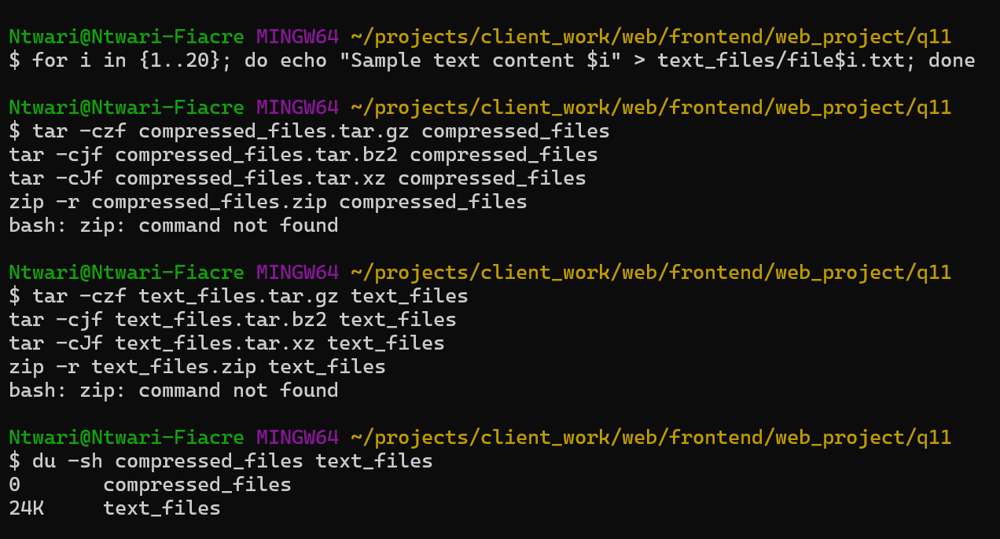
- .png)
- .png)

---

## Q12. Archive management on undocumented system

From q11_and_q12.txt (Question 12 section)

What I Did: Using two sample archives (archive1.tar.gz and archive2.zip), I demonstrated how to list archive contents safely without extraction, extract files matching specific patterns (e.g., .txt, .conf), update existing archives without recreating them (only feasible for some types), handle corrupted archives conceptually with repair commands, and merge multiple archive contents into a new combined archive.

Why I Did It: The goal was to understand how to efficiently manage archives when no prior documentation exists, which is common in inherited systems or during forensic investigations.

What I Learned:
- Different archive types have command-line utilities for safe inspection and selective extraction.
- Some archive formats (like zip) allow easy in-place updates, others (like compressed tar) typically require recreation.
- Repair tools exist for common archive types but aren't always guaranteed to recover all data.
- Merging archives effectively requires extraction then re-archiving.

Challenges and Recommendations:
- Handling corrupted archives is often case-specific and may require backup or forensic tools.
- Always list contents before extraction to avoid unexpected overwrites.
- Maintaining consistent archive naming and structure aids later management.
- For merged archives, careful extraction paths prevent overwriting.

Screenshots:

- 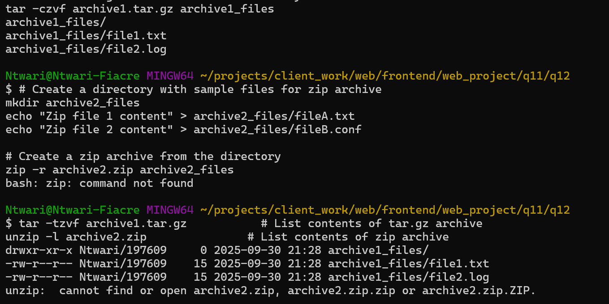
- .png)

---

## Q13. Backup rotation strategy for a production server

From q13.txt

What I Did: I designed and implemented a backup rotation system on a Linux server, incorporating daily incremental backups, weekly full backups, monthly full archives, and automatic cleanup of old backups. Each backup preserves metadata such as file permissions, ownership, and timestamps.

Why I Did It: A backup rotation strategy ensures minimal data loss and efficient use of storage by maintaining multiple restore points without overwhelming disk space. Incremental backups save only changes, speeding up daily backups, while periodic full backups ensure complete restoration capability.

What I Learned:
- How to create incremental backups using tar's snapshot feature to track changed files.
- The significance of full backups for restore point reliability.
- The importance of metadata preservation for file integrity on restoration.
- Automating backup schedules with cron and performing automatic cleanup to manage storage.
- Verifying backup integrity to prevent surprise failures during restore.

Challenges and Recommendations:
- Ensuring cron jobs execute reliably and handling failures gracefully are key to a robust system.
- Balancing backup frequency with available storage and server load is essential.
- Naming conventions were crucial to organize and avoid conflicts in backups.
- Backup verification helps detect corrupt archives early.

Scripts Included (snippets):

```bash
# weekly_backup.sh
#!/bin/bash
backup_dir="/backup/weekly"
src_dir="/important/data"
date=$(date +'%Y-%m-%d')

tar --create --gzip --listed-incremental=/dev/null --file=$backup_dir/backup-$date-full.tar.gz $src_dir
```

```bash
# monthly_backup.sh
#!/bin/bash
backup_dir="/backup/monthly"
src_dir="/important/data"
date=$(date +'%Y-%m-01')

tar --create --gzip --listed-incremental=/dev/null --file=$backup_dir/backup-$date-full.tar.gz $src_dir
```

```bash
# cleanup (cron)
find /backup/* -type f -mtime +30 -name "*.tar.gz" -exec rm {} \;
```

```bash
# verify
tar -tzf backup-yyyy-mm-dd-full.tar.gz > /dev/null
if [ $? -eq 0 ]; then
  echo "Backup is valid"
else
  echo "Backup is corrupted"
fi
```
 

---

## Q14. Troubleshooting user access issues

From q14.txt

Step 1: Analyze current user context and groups

```bash
whoami
groups
groups user2  # compare another user
```

Step 2: Examine /etc/passwd for system vs regular users

```bash
cat /etc/passwd
```

System users usually:
- Have UIDs below 1000 (on many distros)
- Have no login shells (e.g., /sbin/nologin or /bin/false)
- Used for system services (e.g., daemon, bin, sys)

Regular users usually:
- Have UIDs 1000 and above
- Have valid login shells (e.g., /bin/bash)
- Have home directories in /home

Example entries:

```
root:x:0:0:root:/root:/bin/bash                     # System user - root
daemon:x:1:1:daemon:/usr/sbin:/usr/sbin/nologin     # System user
alice:x:1001:1001:Alice:/home/alice:/bin/bash       # Regular user
```

Step 3: Create test scenario and compare groups

```bash
sudo useradd testuser -m -s /bin/bash
groups testuser
sudo usermod -aG adm testuser
groups testuser
```

Step 4: Potential security implications

Regular users with system group memberships may gain unintended elevated privileges. Enforce least privilege: users get only required access for their role.

Screenshots:

- 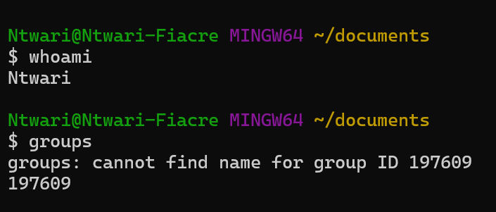
- .png)
- .png)
- .png)

---

## Q15. Group membership propagation and access control

From q15.txt

What I Did: Investigated how changes to group membership propagate to the current user session; demonstrated need to re-login or use `newgrp`; identified which groups grant access to system logs, web server files, and administrative functions; explained the principle of least privilege.

Why I Did It: Understanding group membership propagation is key to troubleshooting user access issues on Linux systems.

What I Learned:
- Current group memberships reflect what the session inherited at login; changes require session restart or `newgrp`.
- Groups like `adm`, `sudo`, and `www-data` grant access to sensitive resources or elevated privileges.
- Improper group assignments can expose security risks.

Challenges and Recommendations:
- Users must log out and back in to apply group changes fully.
- Monitor memberships and restrict according to job requirements.
- Least privilege reduces attack surface; document and audit memberships frequently.

Important Commands Used:
- `id`, `groups` — view effective memberships
- `getent group` — review group listings
- `usermod -aG groupname username` — add users to groups
- `newgrp groupname` — switch group in a session without logging out

Screenshots:

- 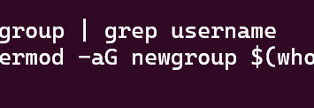
- .png)

---

## Q16. Audit of privilege escalation capabilities using sudo

From q16.txt

What I Did: Audited current sudo permissions and restrictions; contrasted `sudo -i`, `sudo su`, and `su -`; showed executing commands as other users with `sudo -u`; analyzed login and sudo usage patterns from system logs; identified risks with overly permissive sudoers.

What I Learned:
- `sudo -i` starts a root login shell with root environment variables.
- `sudo su` runs `su` as root, switching to root while preserving some environment.
- `su -` switches to root with a login shell, requiring root password.
- Run commands as specific users with `sudo -u <username> <command>`.
- Monitor `/var/log/auth.log` and `journalctl` for sudo usage.
- Overly broad sudoers (e.g., NOPASSWD or ALL) pose risk; restrict and require passwords.

Commands Used:
- `sudo -l`
- `sudo -i`, `sudo su`, `su -`
- `sudo -u <username> <command>`
- `sudo cat /var/log/auth.log | grep sudo`, `journalctl _COMM=sudo`
- `sudo visudo`
 

---

## Q17. Comprehensive forensic analysis setup

From q17.txt

Step 1: Directory structure for different file types

```bash
mkdir -p forensic/{regular_files,directories,symbolic_links,hard_links,device_files,archives}

# Regular files
echo "Regular file 1 content" > forensic/regular_files/file1.txt
echo "Regular file 2 content" > forensic/regular_files/file2.log

# Directories
mkdir forensic/directories/dir1
mkdir forensic/directories/dir2

# Symbolic links
ln -s ../regular_files/file1.txt forensic/symbolic_links/symlink_to_file1

# Hard links (must be on the same filesystem as original)
ln forensic/regular_files/file2.log forensic/hard_links/hardlink_to_file2

# Device files (requires sudo)
sudo mknod forensic/device_files/blockdev b 7 0    # loop device
sudo mknod forensic/device_files/chardev c 1 3     # null device

# Set permission examples
chmod 4755 forensic/regular_files/file1.txt    # setuid
chmod 2755 forensic/regular_files/file2.log    # setgid
chmod 1777 forensic/directories/dir1          # sticky bit on directory
```

Step 2: Setting different ownerships

```bash
sudo chown root:root forensic/regular_files/file1.txt
sudo chown nobody:nogroup forensic/regular_files/file2.log
sudo chown $USER:$USER forensic/directories/dir2
```

Step 3: Create different archives with compression methods

```bash
cd forensic/regular_files
# tar + gzip
tar -czf ../archives/regular_files.tar.gz *
# tar + bzip2
tar -cjf ../archives/regular_files.tar.bz2 *
# tar + xz
tar -cJf ../archives/regular_files.tar.xz *
# zip
zip -r ../archives/regular_files.zip *
```

Step 4: Commands to analyze each element

```bash
# List file types with ls -l and file
ls -l forensic/*
file forensic/regular_files/*

# Check symbolic links
ls -l forensic/symbolic_links
readlink forensic/symbolic_links/symlink_to_file1

# Check device files
ls -l forensic/device_files
file forensic/device_files/*

# Check permissions and special bits
ls -l --color=auto forensic/regular_files
lsattr forensic/regular_files/*

# Check ownerships
ls -l forensic/regular_files
stat forensic/regular_files/file1.txt

# Verify archives
tar -tf forensic/archives/regular_files.tar.gz
unzip -l forensic/archives/regular_files.zip
```

Commands Used: mkdir, touch, ln, mknod, chmod, chown, ls -l, file, readlink, stat, tar, unzip. Permission and metadata checks help in forensic investigation and monitoring.
 

---

Notes:
- I didn't have fun with sudo applications because password field seem not working well for me. Password yanganga kbs knd ariyo nakoreshe muri authentication yo kwinjira muri machine
