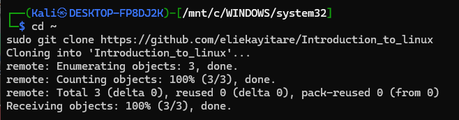
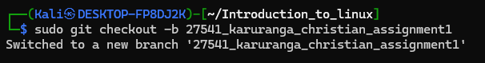
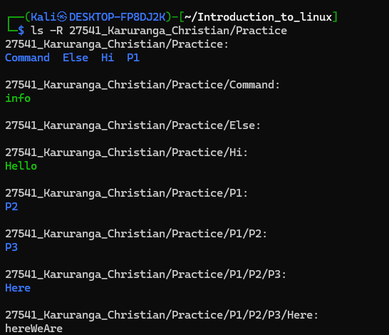
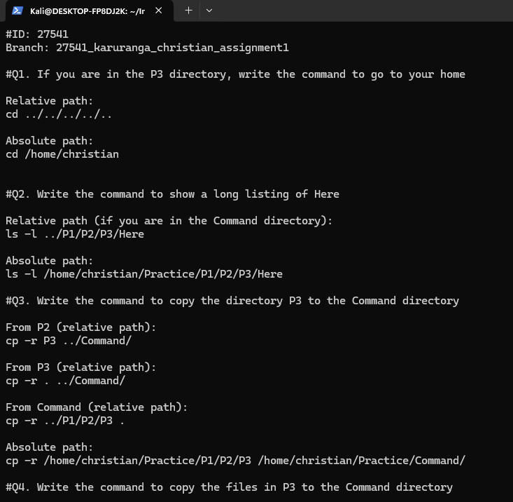

**Name:** Karuranga Christian 
**ID:** 27541 
**Branch:** 27541_karuranga_christian_assignment1 

---

## What I Did
- Cloned the repository and created a new branch. 
- Built the Practice directory structure. 
- Created required files:
  - `info` (bash script, executable, in Command) 
  - `Hello` (bash script, executable, in Hi) 
  - `hereWeAre` (text file in Here). 
- Answered all assignment questions in `assignment1.txt`. 
- Took screenshots of cloning, branching, tree structure, and assignment answers. 

---

## Why I Did It
This assignment helped me: 
- Practice absolute and relative navigation. 
- Learn how to view detailed listings with `ls -l`. 
- Understand the difference between copying directories and only their contents. 
- Recognize Linux color codes for files and directories. 

---

## What I Learned
- **Relative vs absolute paths** and how to switch between them. 
- `ls -l` shows permissions, owner, group, and file details. 
- `cp -r` is required to copy directories. 
- File color codes: **blue = directory, yellow = executable, white = normal file**. 

---

## Screenshots
-  
-  
-  
-  

---
