# COSC 8312 — Assignment 1: Introduction to Linux Basic Commands
**Student ID:** `26510`  
**Name:** `MAHIRWE Yvette`  
**Username (login directory):** `HP`  
**Branch name:** `26510_Mahirwe_Yvette_assignment1`

---

## Q1. From `P3` directory, go to your home
1) **Relative path**
```bash
cd ~
# OR cd without specifying anything
cd 
```
2) **Absolute path**:
```bash
cd C:/Users/HP
```

### Screenshots

  - `./screenshots/q1-relative.png`
    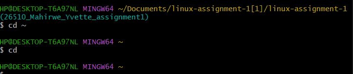
  - `./screenshots/q1-absolute.png`
    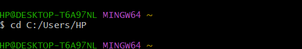

---

## Q2. Show a long listing of `Here`
> Context: “if you are in the `Command` directory”.

1) **Relative path (from `Command`)**
```bash
ls -l ../P1/Hi/P3/Here/
```

2) **Absolute path**
```bash
ls -l C:/Users/HP/practice/P1/Hi/P3/Here/
```

### Screenshot
- `./screenshots/q2-relative.png`
    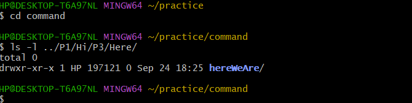
- `./screenshots/q2-absolute.png`
    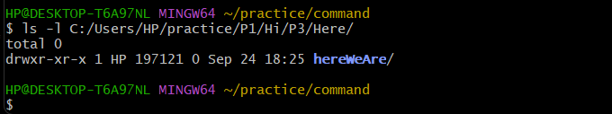

---

## Q3. Copy **the file** `P3` to the `Command` directory
> The intent here is copying a single file named `P3`.

- **From `P2` directory (relative)**  
```bash
 cp ../Hi/P3/P3 ../../command
```
- **From `P3` directory (relative)**  
```bash
$ ls ../../command

```
- **From `Command` directory (relative)**  
```bash
 cp ./P3 ../command

```
- **Absolute path**  
```bash
 cp C:/Users/HP/practice/P1/Hi/P3/P3 C:/Users/HP/practice/command


 
### Screenshot

 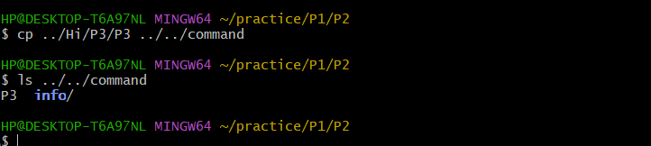
-
  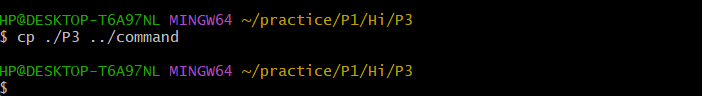

    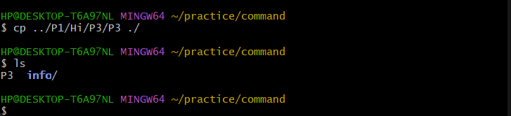
- 
  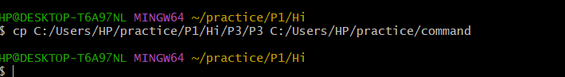

---

## Q4. Copy **the files inside** `P3` to the `Command` directory
> The intent here is copying *contents of the directory* `P3/`.

- **From `P2` directory (relative)**  
```bash
cp -r ../Hi/P3/* ../../command


```
- **From `P3` directory (relative)**  
```bash
cp * ../../../../command

```
- **From `Command` directory (relative)**  
```bash
cp -r ../P1/Hi/P3/* ./

```
- **Absolute path**  
```bash
cp -r C:/Users/HP/practice/P1/Hi/P3/* C:/Users/HP/practice/command

```
### Screenshot

 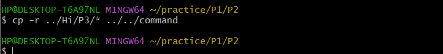
-
  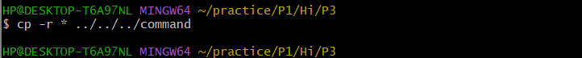

    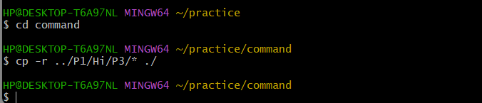
- 
  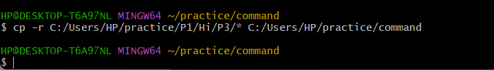


---

## Q5. Difference between Q3 and Q4
- **Q3:** Copies a **single file** named `P3`.
- **Q4:** Copies **all files** contained **inside** the `P3` directory.

---

## Q6. Colors in `ls` output (LS_COLORS)
- **Blue** → Directory
- **Green** → Executable file (or symlink to executable)
- **Yellow** → Device/special file (or sometimes setuid/setgid files depending on theme)

**hereWeAre** should be **green** *if it’s executable*, otherwise it will appear in the default file color (often white).

---

## Appendix: Useful commands for screenshots
```bash
# Show current directory path
pwd

# Show relative/absolute paths as you navigate
ls -l
tree -L 2
```
