# 🐧 Introduction to Linux — Assignment 2  
**Course Code:** COSC 8312  
**Student:** Dushimimana Prince 👑  
**ID:** 27555  
**Date:** 28-September 2025 

## 📌 Overview
This repository contains my solutions for **Assignment 2 – Individual**, as part of the Introduction to Linux course.

Each question includes:
- The explanation or commands used.
- A screenshot of the output (where applicable).

---

## ✅ Questions & Answers

### **Q1. Linux Directories and Their Purpose**
- Discussed `/bin`, `/etc`, `/var`, `/usr`, `/tmp`, `/opt`, `/boot`, `/home`  
- Identified where attackers might modify configuration files, binaries, and log files.  
*(No screenshot required)*

---

### **Q2. Project Directory Structure**
- Created nested project folders with minimum commands.  
📸 *Screenshot: 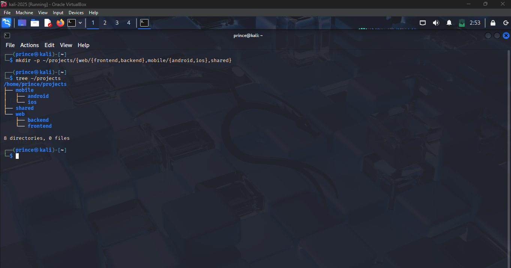*

---

### **Q3. Navigating with Limited `cd` Commands**
- Showed navigation between directories without exceeding 3 `cd` uses.  
📸 *Screenshot: 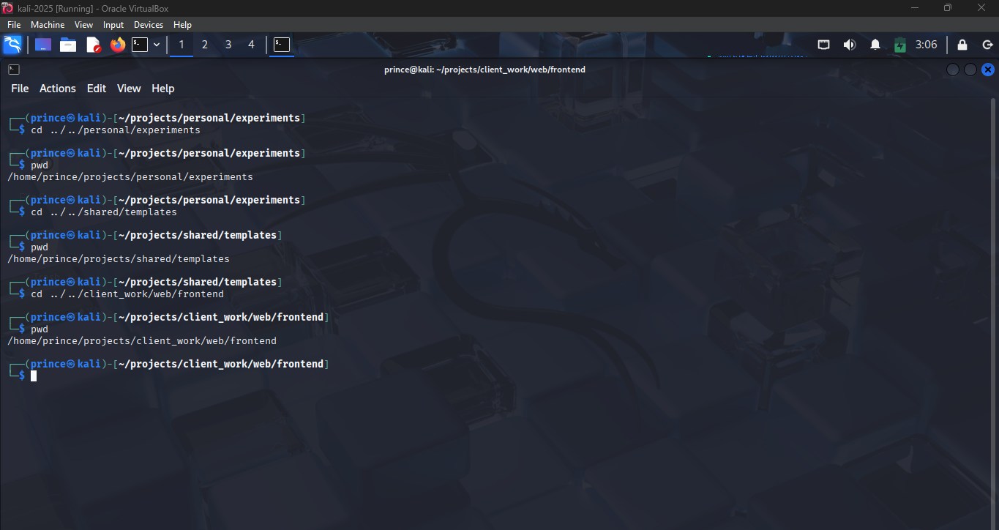*

---

### **Q4. Web Project Structure**
- Created 15 HTML files, 8 CSS files, 6 JS files, and 20 backup files using efficient commands.  
📸 *Screenshot: 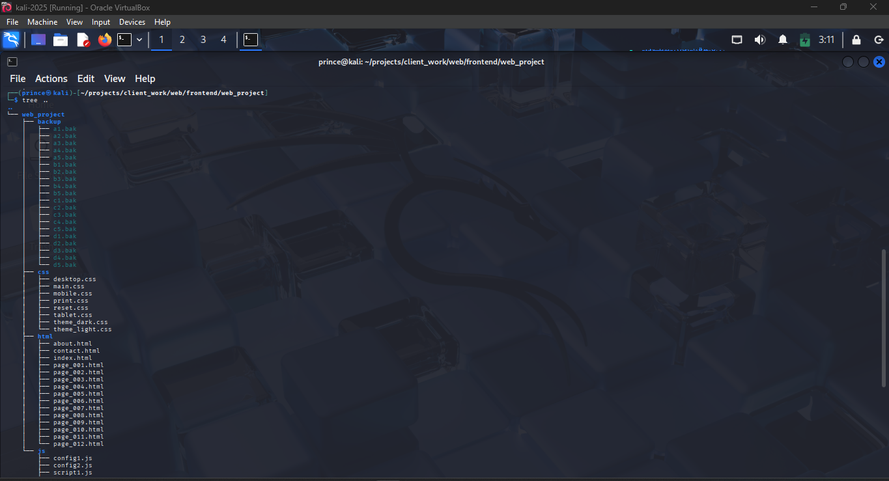*

---

### **Q5. Wildcard File Management**
- Used wildcards to:
  - Move numbered files → `archive/`
  - Copy CSS files (excluding mobile/tablet) → `desktop/`
  - List files with exactly 3 characters before extension
  - Match files starting with consonants
  - Find extensions of exactly 2 chars  
📸 *Screenshot: 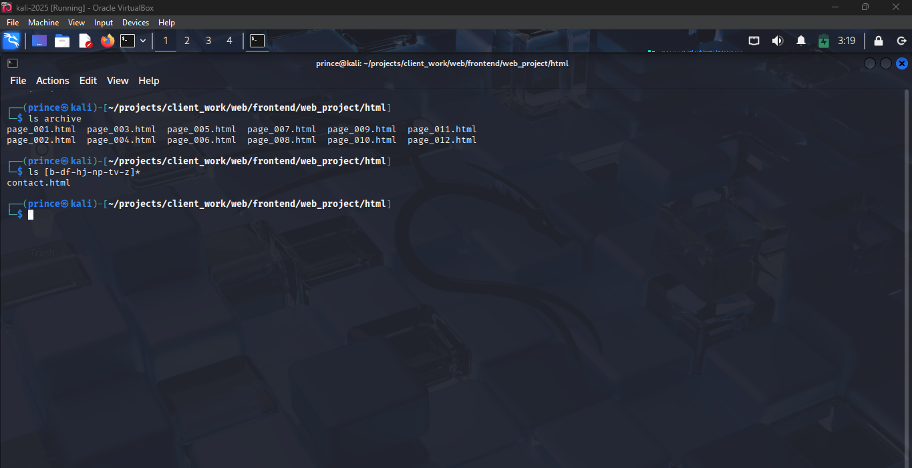*

---

### **Q6. Brace Expansion**
- Generated logs for Q1 2024, config files across 3 services, and test files with A–C and 10–12.  
📸 *Screenshot: 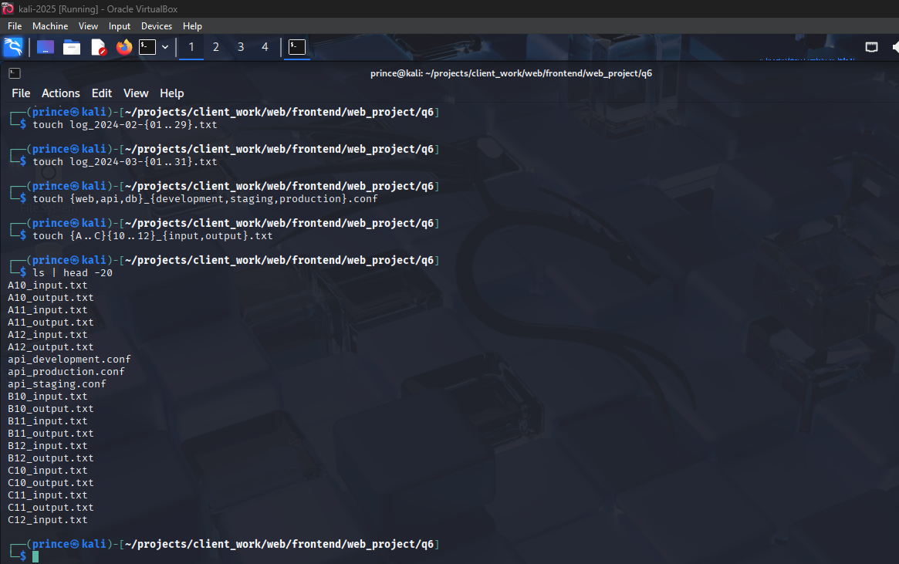*

---

### **Q7. Linux vs Windows Line Endings**
- Created files with LF vs CRLF endings, compared with `diff`, `cmp`, and `comm`.  
- Learned about cross-platform compatibility issues.  
📸 *Screenshot: 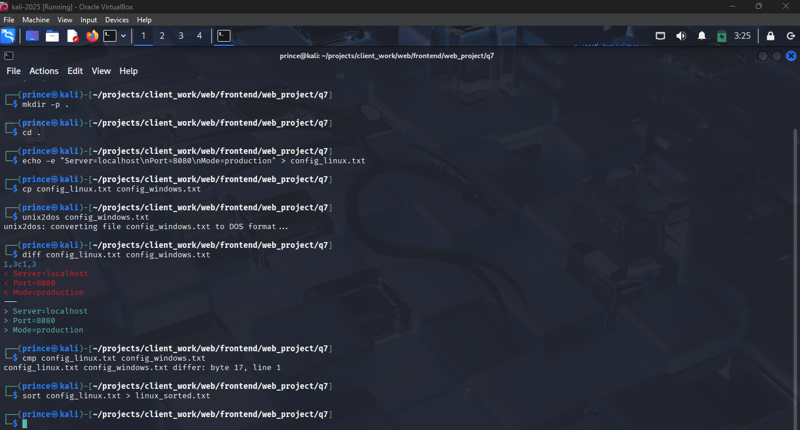*

---

### **Q8. Using `find` for Security Audit**
- Found:
  - Files larger than average
  - Files modified in last 72h but not 24h
  - Empty/hidden-only directories
  - World-writable files
  - Files owned by others
  - Backup/temp-like files  
📸 *Screenshot: 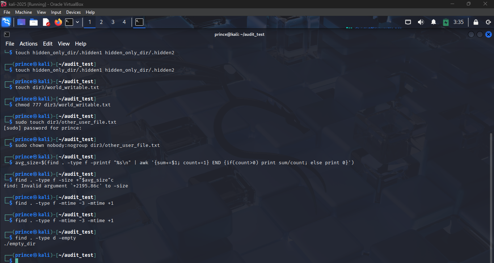*

---

### **Q9. Log File Analysis**
- Created log file (200+ lines).  
- Extracted middle 50 lines, searched for last occurrence of a word with context, timed tools, and explained why `less` is better than `cat`.  
📸 *Screenshot: 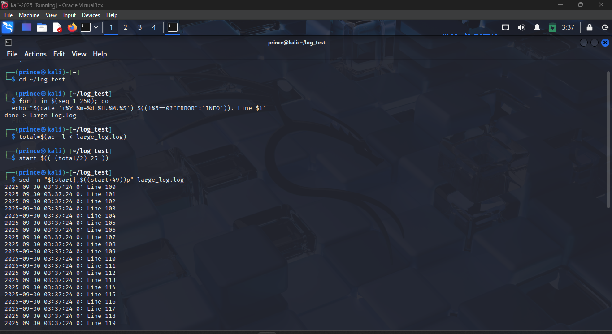*

---

### **Q10. Automating File Maintenance**
- Used `find -exec` to:
  - Change permissions
  - Calculate disk space
  - Backup `.conf` files
  - Safely remove temp files  
📸 *Screenshot: 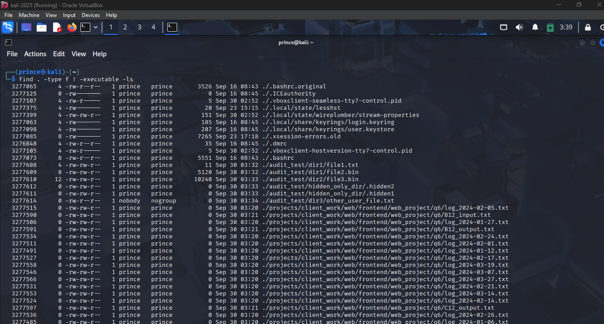*

---

### **Q11. Compression Comparisons**
- Tested `tar+gzip`, `tar+bzip2`, `tar+xz`, and `zip`.  
- Compared results for already-compressed vs text files.  
- Recommended best method for automated backups.  
📸 *Screenshot: 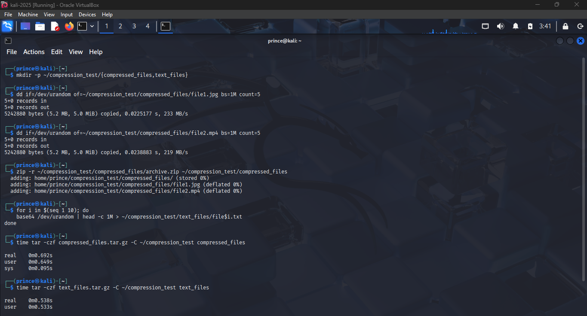*

---

### **Q12. Archive Management**
- Examined archives without extraction, extracted patterns, updated archives, handled corruption, and merged different formats.  
📸 *Screenshot: 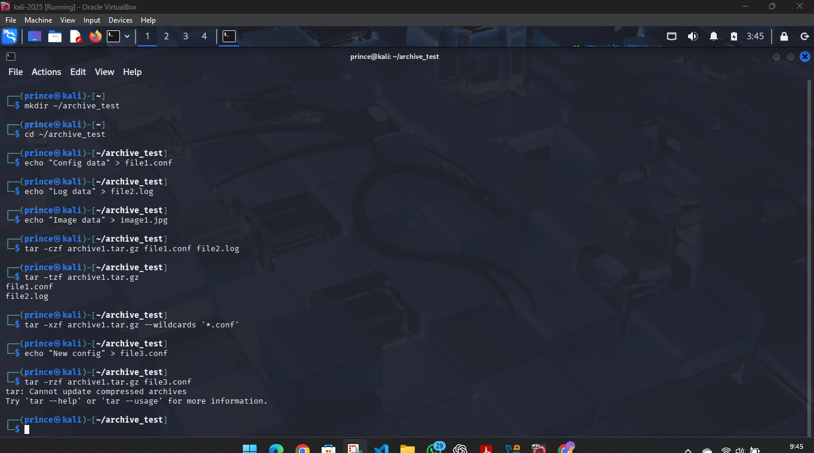*

---

### **Q13. Backup Rotation Strategy**
- Designed daily incremental, weekly full, monthly archive system.  
- Preserved metadata and verified integrity.  
📸 *Screenshot: 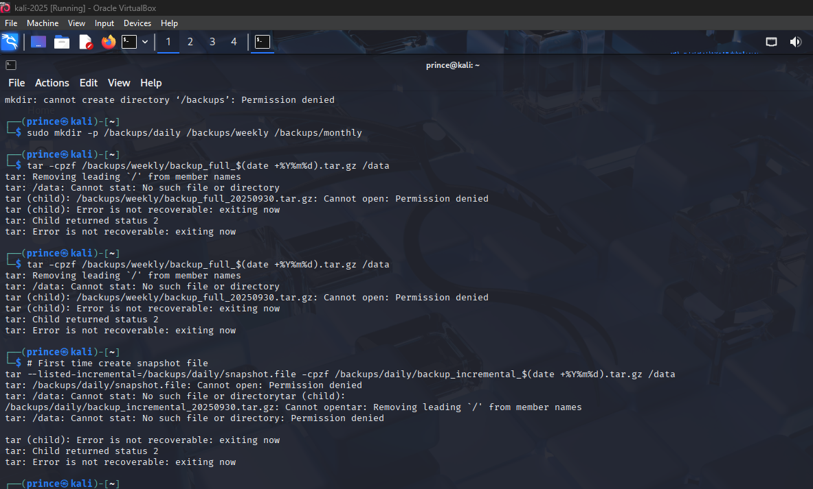*

---

### **Q14. User and Group Analysis**
- Compared groups, analyzed `/etc/passwd` for system vs normal users, explained security implications.  
📸 *Screenshot: 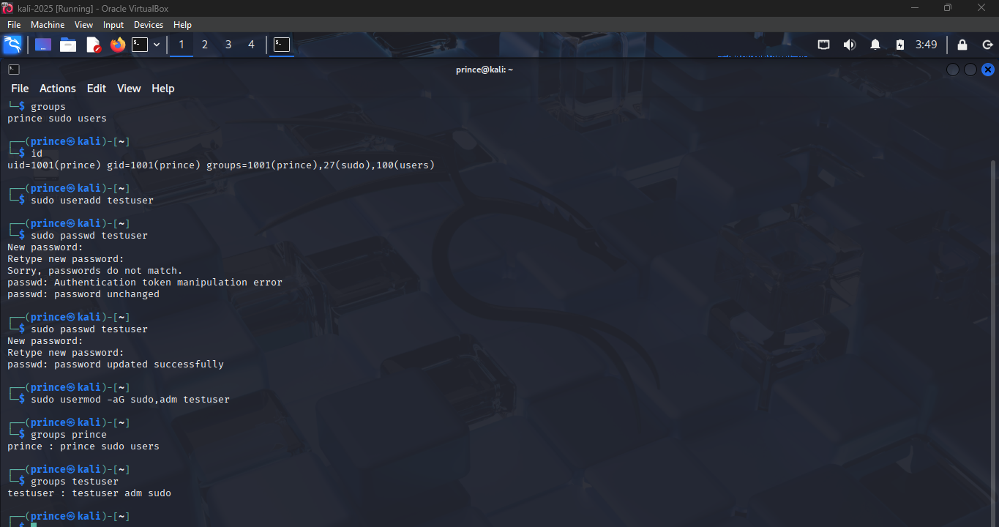*

---

### **Q15. Group Membership Propagation**
- Demonstrated login required for group changes.  
- Identified groups for logs, web server, admin.  
- Explained least privilege principle.  
📸 *Screenshot: 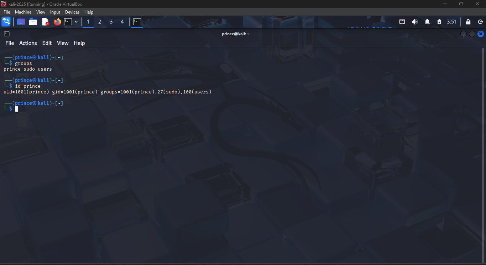*

---

### **Q16. Sudo Permissions Audit**
- Compared `sudo -i`, `sudo su`, `su -`.  
- Ran commands as other users.  
- Checked system logs for login patterns.  
- Suggested improvements to sudo configs.  
📸 *Screenshot: 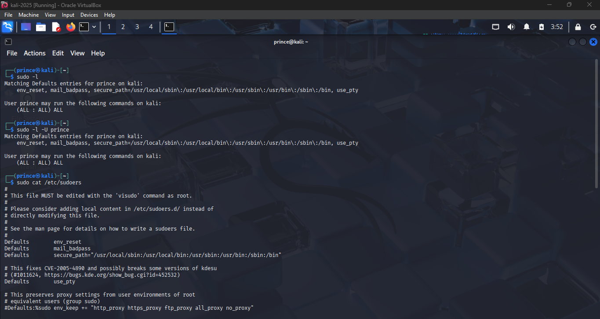*

---

## 📚 What I Learned
- Efficient navigation and file creation with wildcards and brace expansion.  
- Importance of permissions, ownership, and groups for system security.  
- How compression tools vary by data type.  
- Backup strategies and archive management.  
- Troubleshooting group/permission issues and auditing `sudo`.  

---

## ⚡ Challenges
- Remembering precise wildcard/brace patterns.  
- Managing complex `find` queries with multiple conditions.  
- Distinguishing subtle sudo differences.  

---

## 💡 Recommendations
- Always preview dangerous operations with `-exec echo`.  
- Use the right compression tool based on content type.  
- Apply least privilege when assigning groups/permissions.  

---

📂 **Folder Structure**
