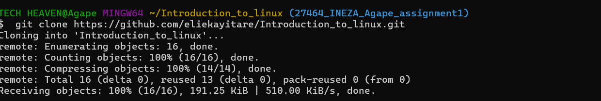

**Name:** Ineza Agape 
**ID:** 27464 

#Branch: 27464_ineza_agape_assignment1  

## What I Did
- Cloned the repo and created a branch. 
- Created the **test** directory structure with required subfolders. 
- Added files: `info`, `Hello`, and `hereWeAre`. 
- Wrote answers in `assignment1.txt`. 
- Took screenshots of cloning, branching, directory tree, and answers. 

---

## Why I Did It
To practice Linux basics: navigating with absolute and relative paths, copying files vs directories, and understanding file colors. 

---

## What I Learned

- The difference between `cp` and `cp -r`.  - `ls -l` shows detailed file info. 
- Colors in Linux (blue, yellow, white). 
- How to organize files in a structured repo. 

---

## Screenshots
-  
-  
-  
-  

---
