````markdown
# Assignment 2 – Introduction to Linux  
**Name:** Ajibewa Irekarnmi Johnson  
**ID:** 25626  

---

## Q1 – Investigating System Directories
**Command:**
```bash
ls -ld /bin /etc /var /usr /tmp /opt /boot /home
````

**Screenshot:** 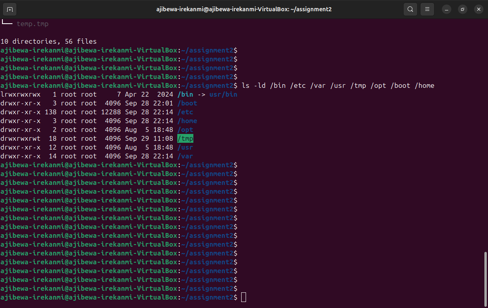
**Explanation:** These directories are critical. For example, `/etc` holds configs, `/bin` has system binaries, `/var/log` stores logs, `/tmp` can hide malicious scripts, etc.

---

## Q2 – Developer Project Structure

**Command:**

```bash
mkdir -p ~/projects/{client_work/{web/{frontend,backend,database},mobile/{ios,android}},personal/{experiments,archive},shared/{templates,resources}}
```

**Screenshot:** 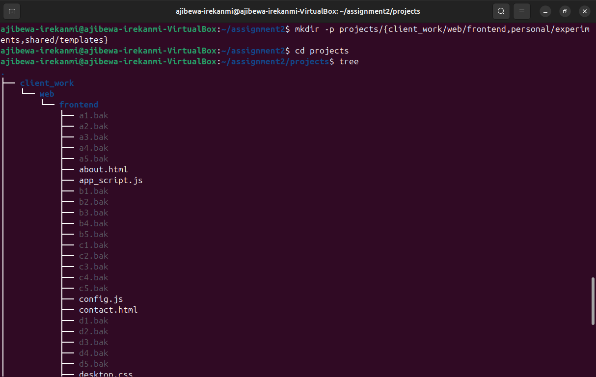
**Explanation:** This creates the hierarchical structure for web, mobile, personal, and shared projects.

---

## Q3 – Relative Navigation

**Commands + Output:**

```bash
cd ~/projects/client_work/web/frontend
pwd
cd ../../../personal/experiments
pwd
cd ../../shared/templates
pwd
cd ../../client_work/web/frontend
pwd
```

**Screenshot:** 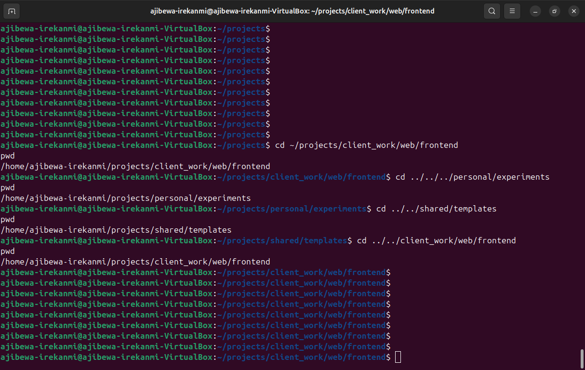
**Explanation:** Shows navigation using only relative paths (`..`), not absolute.

---

## Q4 – Web Project Files

**Command:**

```bash
touch {index,about,contact}.html page_{001..012}.html
touch {main,reset,theme_light,theme_dark,mobile,tablet,desktop,print}.css
touch {app_script,helper_util,config,extra_script,more_util,site_config}.js
touch {a,b,c,d}{1..5}.bak
```

**Screenshot:** 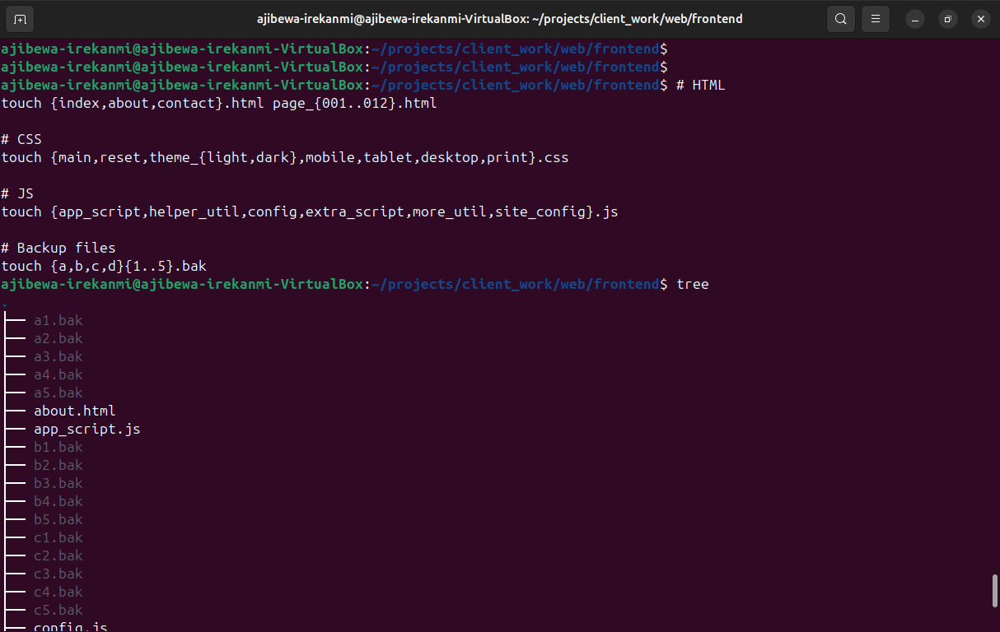
**Explanation:** Creates HTML, CSS, JS, and backup files with expansion.

---

## Q5 – Wildcards

**Key Commands:**

```bash
mv *[0-9].* archive/
shopt -s extglob
cp !(mobile|tablet).css desktop/
ls ???.*
ls [b-df-hj-np-tv-z]*
ls *.[a-zA-Z][a-zA-Z]
```

**Screenshot:** 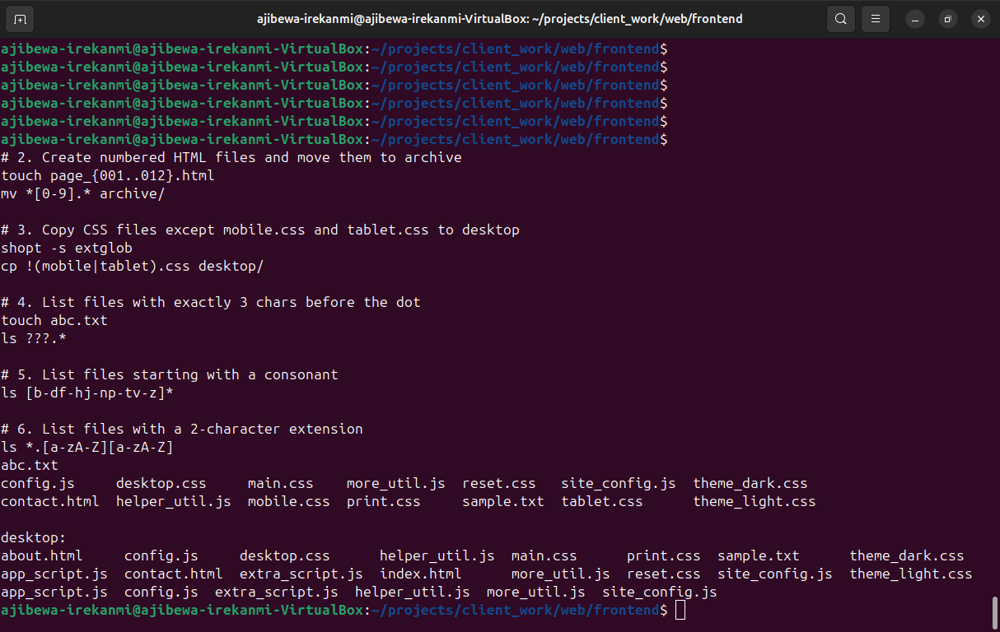
**Explanation:** Demonstrates moving numbered files, copying with exclusions, and pattern matching with wildcards.

---

## Q6 – Brace Expansion

**Command:**

```bash
# Logs
touch log_{2024-01-{01..31},2024-02-{01..29},2024-03-{01..31}}.txt

# Configs
touch {web,api,db}_{dev,staging,prod}.conf

# Tests
touch {A..C}{10..12}_{input,output}.txt
```

**Screenshot:** 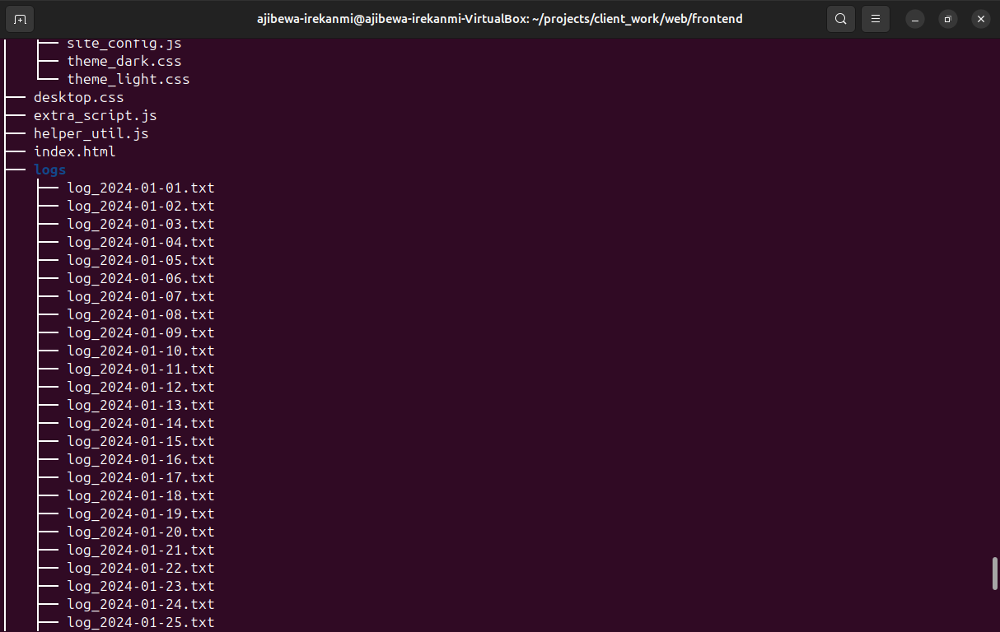
**Explanation:** Brace expansion quickly generates files for logs, configs, and tests.

---

## Q7 – Line Ending Comparison

**Command:**

```bash
echo "Hello Linux vs Windows" > linux.txt
cp linux.txt windows.txt
unix2dos windows.txt
diff linux.txt windows.txt
cmp linux.txt windows.txt
comm linux.txt windows.txt
```

**Screenshot:** 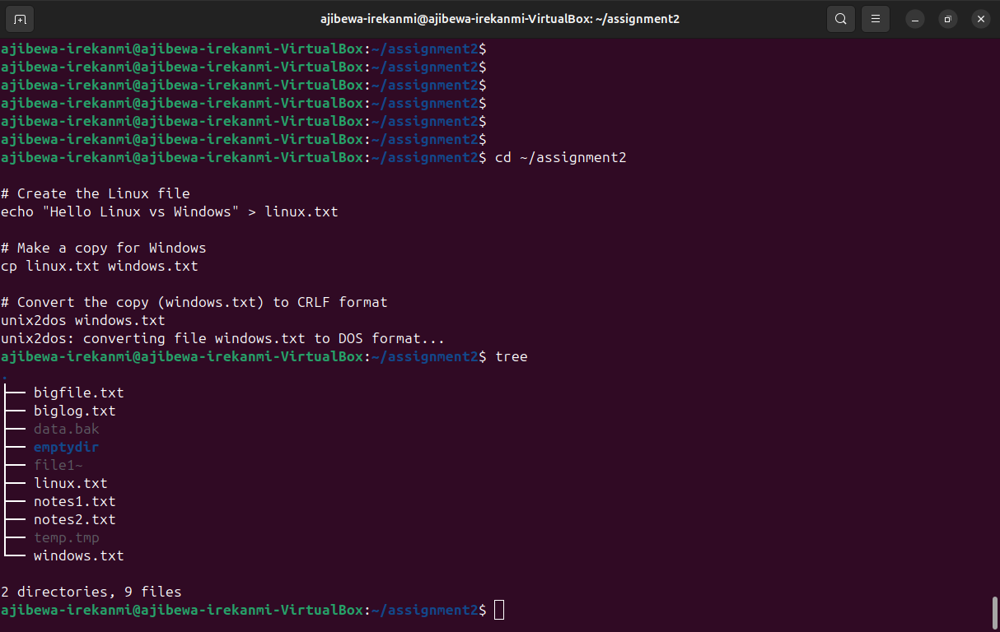
**Explanation:** Linux files use LF, Windows files use CRLF (`^M` seen in diff).

---

## Q8 – File Search

**Command:**

```bash
find . -type f -size +1M
find . -type f -mtime -3 ! -mtime -1
find . -type d -empty
find . -type f -perm -o=w
find . ! -user $USER ! -user root
find . -type f \( -name '*~' -o -name '*.bak' -o -name '*.tmp' \)
```

**Screenshot:** 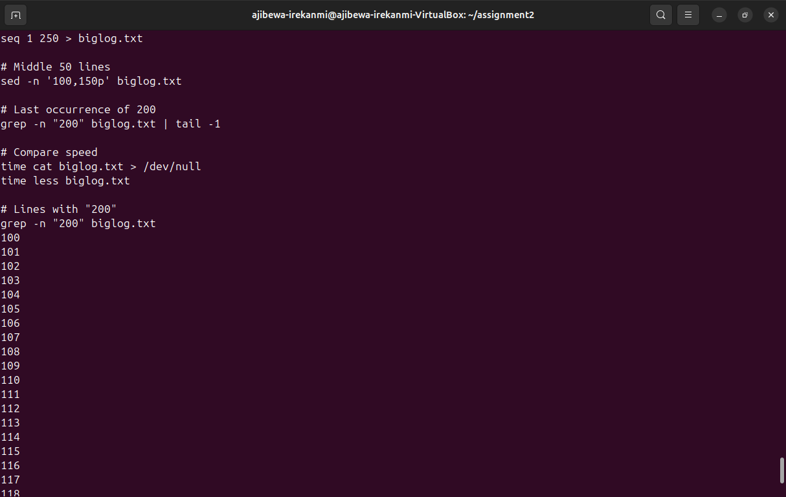
**Explanation:** Demonstrates `find` usage for size, time, permissions, ownership, and temp/backup detection.

---

## Q9 – Large Log File

**Command:**

```bash
seq 1 250 > biglog.txt
sed -n '100,150p' biglog.txt
grep -n "200" biglog.txt | tail -1
time cat biglog.txt > /dev/null
time less biglog.txt
grep -n "200" biglog.txt
```

**Screenshot:** 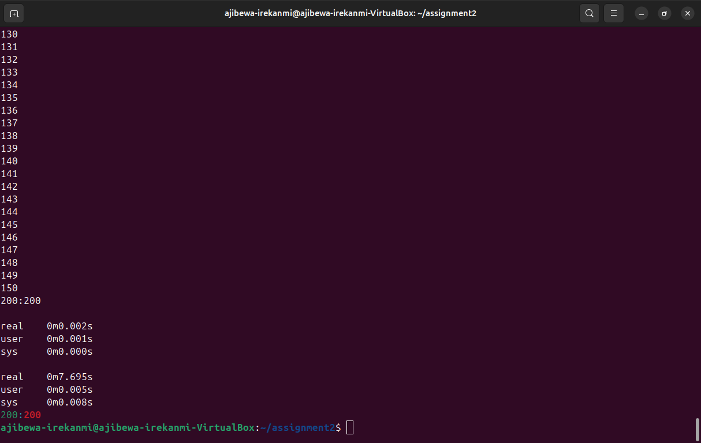
**Explanation:** Works with logs, shows middle lines, last match, and command timing.

---

## Q10 – File Maintenance

**Command:**

```bash
find . -type f ! -perm 755 -exec chmod 644 {} \;
find . -type f -mtime +30 -exec du -ch {} + | tail -n 1
find . -type f -name "*.conf" -exec cp {} {}.backup \;
find . -type f -name "*.tmp" -atime +7 -print
find . -type f -name "*.tmp" -atime +7 -delete
```

**Screenshot:** 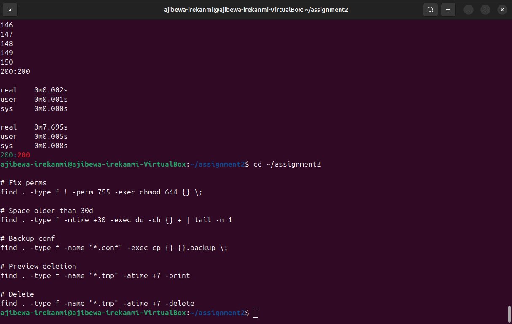
**Explanation:** Standard maintenance for fixing permissions, checking old files, and cleaning up temp files.

---

## Q11 – Compression

**Command:**

```bash
tar -czf text.tar.gz txt/
tar -cjf text.tar.bz2 txt/
tar -cJf text.tar.xz txt/
zip -r text.zip txt/
time tar -czf img.tar.gz img/
```

**Screenshot:** 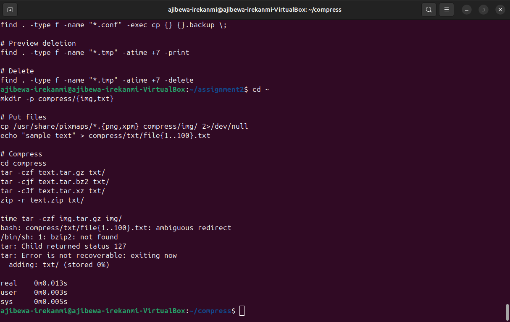
**Explanation:** Tests gzip, bzip2, xz, and zip. Text compresses well, images not much.

---

## Q12 – Archive Manipulation

**Command:**

```bash
tar -tf text.tar.gz
unzip -l text.zip
tar -xzf text.tar.gz --wildcards '*.txt'
echo "new stuff" > newfile.txt
tar -rf text.tar.gz newfile.txt
tar -cf all.tar text.tar.gz img.tar.gz
```

**Screenshot:** 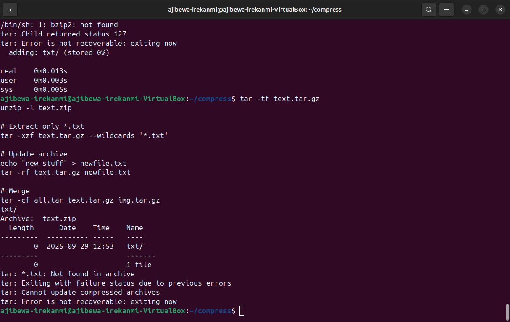
**Explanation:** Viewing, extracting, updating, and merging archives.

---

## Q13 – Backup Rotation

**Command:**

```bash
tar -czf backup-$(date +%F).tar.gz --listed-incremental=backup.snar /etc
tar -czf full-week$(date +%V).tar.gz /etc
tar -czf archive-$(date +%Y-%m).tar.gz /etc
```

**Screenshot:** 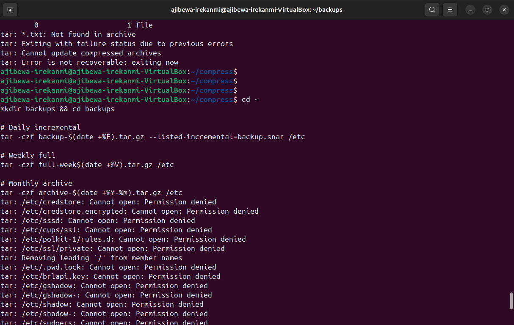
**Explanation:** Daily incremental, weekly full, and monthly archives.

---

## Q14 – Users & Groups

**Command:**

```bash
id
groups
cat /etc/passwd | less
```

**Screenshot:** 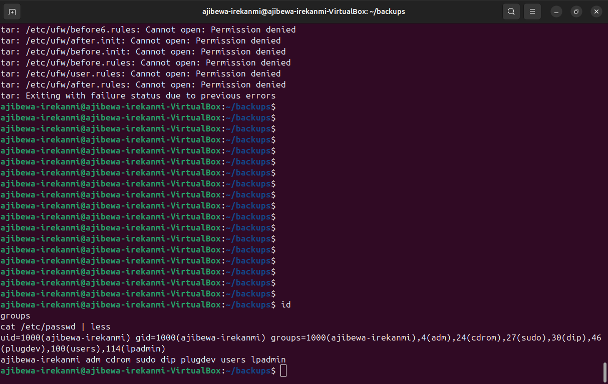
**Explanation:** Shows user ID, group memberships, and all system users.

---

## Q15 – Group Propagation

**Command:**

```bash
id
sudo adduser testuser
sudo usermod -aG sudo testuser
su - testuser
groups
```

**Screenshot:** 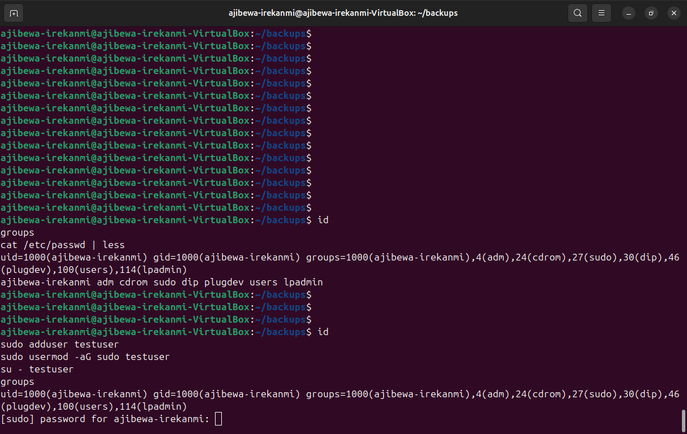
**Explanation:** User must re-login to get new group permissions.

---

## Q16 – Sudo Audit

**Command:**

```bash
sudo -l
sudo -i
sudo su
su -
sudo -u root whoami
sudo less /var/log/auth.log
```

**Screenshot:** 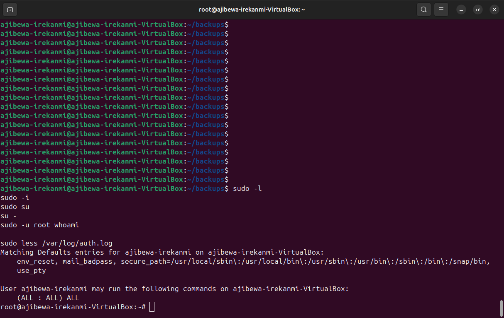
**Explanation:** Demonstrates sudo privileges and auditing through auth logs.

---

## Bonus Q17 – Forensic Lab

**Command:**

```bash
mkdir forensic && cd forensic
touch regular.txt
mkdir dir
ln regular.txt hardlink
ln -s regular.txt symlink
touch setuid; chmod 4755 setuid
touch setgid; chmod 2755 setgid
touch sticky; chmod 1755 sticky
sudo chown root:root regular.txt
ls -l
```

**Screenshot:** 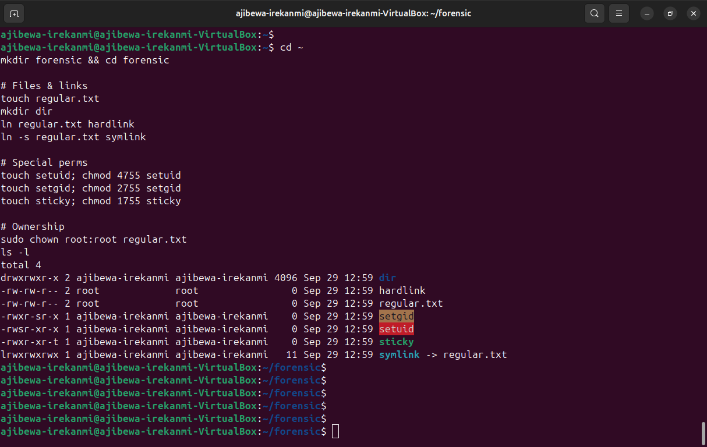
**Explanation:** Demonstrates file links, setuid/setgid/sticky bits, and ownership.

---

# ✅ Summary

* Learned directory management, permissions, compression, backups, and system auditing.
* Used `find`, `tar`, `diff`, `comm`, `unix2dos`, and `sudo`.
* Practiced relative navigation and file expansions.
* Gained skills in both daily Linux usage and forensic analysis.

```
