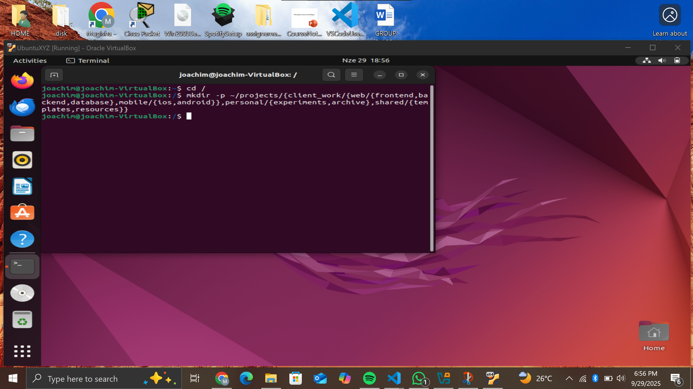
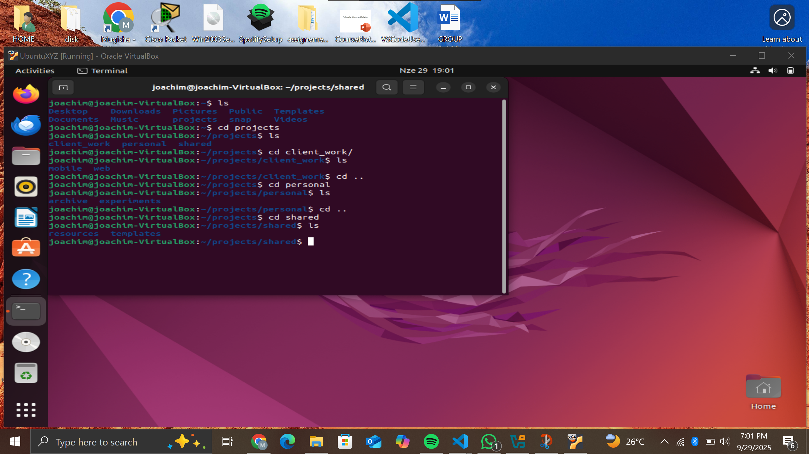

## Question 1
Commands used:  
cd / (change directory into the root directory)  
ls (listing all the directories inside the root folder) 
Output description: Lists root directories including bin, etc, var, usr, tmp, opt, boot, home.
Explanation and reasoning: 

/bin: Contains essential binaries (e.g., ls, cp) that could be replaced with malicious ones by an attacker to backdoor common commands. 
/etc: Contains system configuration files (e.g., /etc/passwd, /etc/shadow) that an attacker might modify to add users or change settings. 
/var: Contains log files (e.g., /var/log/auth.log) that might show intrusion evidence like failed logins or sudo usage.  
/usr: Contains user binaries and libraries; an attacker might replace non-essential binaries here, but less critical than /bin. 
/tmp: Temporary files; attackers often place exploits here as it's world-writable, but not for configs orlogs.  
/opt: Optional software; might contain third-party binaries that could be maliciously replaced, but not core system ones.  
/boot: Bootloader files (e.g., kernel); an attacker might modify for persistence, but not typical for configs or logs.  
/home: User home directories; might contain user-specific configs or evidence of compromise in user files, but not system-wide.  

Most likely: /etc for configs, /bin for binaries, /var for logs.  

## Question 2 
Commands used (minimum, using -p for parents): 
mkdir -p ~/projects/{client_work/{web/{frontend,backend,database},mobile/{ios,android}},personal/{experiments,archive},shared/{templates,resources}}   
Output description: No output if successful; use tree ~/projects to verify the tree structure matching the diagram.  
This works even if parents exist because of -p. One command total.  

---
