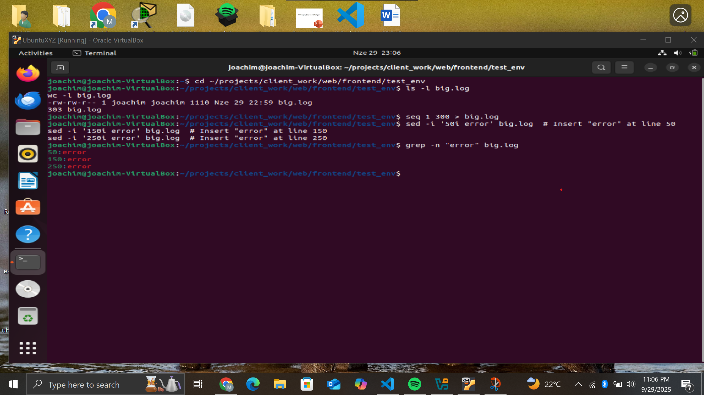

## Question 1
Commands used:  
```powershell
cd / (change directory into the root directory)  
ls (listing all the directories inside the root folder) 
```
Output description: Lists root directories including bin, etc, var, usr, tmp, opt, boot, home.
Explanation and reasoning: 

/bin: Contains essential binaries (e.g., ls, cp) that could be replaced with malicious ones by an attacker to backdoor common commands. 
/etc: Contains system configuration files (e.g., /etc/passwd, /etc/shadow) that an attacker might modify to add users or change settings. 
/var: Contains log files (e.g., /var/log/auth.log) that might show intrusion evidence like failed logins or sudo usage.  
/usr: Contains user binaries and libraries; an attacker might replace non-essential binaries here, but less critical than /bin. 
/tmp: Temporary files; attackers often place exploits here as it's world-writable, but not for configs orlogs.  
/opt: Optional software; might contain third-party binaries that could be maliciously replaced, but not core system ones.  
/boot: Bootloader files (e.g., kernel); an attacker might modify for persistence, but not typical for configs or logs.  
/home: User home directories; might contain user-specific configs or evidence of compromise in user files, but not system-wide.  

Most likely: /etc for configs, /bin for binaries, /var for logs.  


## Question 2   

Commands used (minimum, using -p for parents):   

```powershell

mkdir -p ~/projects/{client_work/{web/{frontend,backend,database},mobile/{ios,android}},personal/{experiments,archive},shared/{templates,resources}}  
```
Output description: No output if successful; use tree ~/projects to verify the tree structure matching the diagram.  
This works even if parents exist because of -p. One command total.


---


## Question 3

Commands used :

```powershell
cd ../../../../personal/experiments
pwd  # Proves: /home/user/projects/personal/experiments
cd ../../shared/templates
pwd  # Proves: /home/user/projects/shared/templates
cd ../../client_work/web/frontend
pwd  # Proves: /home/user/projects/client_work/web/frontend (back to start)
```

In the screenshot provided some of the codes failed, so in total it was only 2 cds

## Question 4

Commands used :
The touch command creates files.
```powershell
touch {index,about,contact}.html page_{001..012}.html
touch {main,reset,theme_light,theme_dark,mobile,tablet,desktop,print}.css
touch {main_script,util_script,config_script,helper_script,app_script,lib_script}.js  # Variations with 'script', 'util', 'config'
touch {a1,a2,a3,a4,a5}.bak {b1,b2,b3,b4,b5}.txt {c1,c2,c3,c4,c5}.log {d1,d2,d3,d4,d5}.zip  # 5 each starting with a,b,c,d, mixed extensions
```


## Question 5 

Commands used :

```powershell
mkdir archive desktop # Creating the folders archive and desktop
mv page_*[0-9].html archive/  # Move files like page_001.html (ending in numbers before extension); pattern: *[0-9].* but specified to HTML for precision
cp *.css desktop/ && rm desktop/*{mobile,tablet}*.css  # Copy all CSS, then remove those containing 'mobile' or 'tablet'
ls ???.*  # List files with exactly 3 chars before the dot (e.g., abc.txt); if no match, outputs error or nothing
ls [bcdfghjklmnpqrstvwxyzBCDFGHJKLMNPQRSTVWXYZ]*  # Files starting with consonant (not aeiouAEIOU)
ls *.??  # Identify files with exactly 2-char extensions (e.g., *.js)
```


## Question 6

Commands used :

```powershell
touch log_2024-{01..03}-{01..31}.txt  # Logs for Jan-Mar 2024 (handles non-31 days manually if needed, but efficient)
touch {dev,staging,prod}_{web,api,db}.conf  # Configs for environments x services
touch {A,B,C}{10..12}_{input,output}.txt  # Test files A10_input.txt etc.
```


## Question 7

```powershell
echo -e "Line1\nLine2\nLine3" > linux.conf  # Linux LF
echo -e "Line1\r\nLine2\r\nLine3" > windows.conf  # Windows CRLF
diff linux.conf windows.conf  # Shows differences due to endings
cmp linux.conf windows.conf  # Reports byte where they differ
comm linux.conf windows.conf  # Shows unique/common, but mangled due to endings
```
Output description: diff shows all lines differ; cmp shows first differing byte; comm shows all in columns 1 and 2.
Lesson: Cross-platform compatibility requires consistent line endings; tools like dos2unix fix this, as Windows CRLF can break Linux scripts.


## Question 8

```powershell
mkdir test_env
cd test_env
touch file{1..10} hidden.{1..5} largefile smallfile
dd if=/dev/zero of=largefile bs=1M count=10  # 10MB
touch -m -t $(date -d '-50 hours' +%Y%m%d%H%M) file{1..3}  # Modified 50h ago
mkdir empty_dir hidden_only_dir
touch hidden_only_dir/.hidden
chmod o+w world_writable
sudo chown nobody other_owned  # Assume sudo available
touch temp~ backup.bak

Find Commands

find . -type f -size +$(find . -type f -printf '%s\n' | awk '{sum+=$1; n++} END {print int(sum/n)}')c  # Larger than avg size
find . -type f -mtime -3 -a ! -mtime -1  # Modified last 72h but not 24h
find . -type d \( -empty -o \( ! -name . -prune -exec sh -c 'ls -A "$0" | grep -qv "^\." && exit 1 || exit 0' {} \; \) \)  # Empty or only hidden
find . -perm -o=w  # World-writable
find . -not -user $USER -not -user root  # Owned by others
find . \( -name "*~" -o -name "*.bak" \)  # Temp/backup
```


## Question 9

```powershell
ls -l big.log
wc -l big.log
seq 1 300 > big.log
sed -i '50i error' big.log  # Insert "error" at line 50
sed -i '150i error' big.log  # Insert "error" at line 150
sed -i '250i error' big.log  # Insert "error" at line 250
grep -n "error" big.log

head -n 175 big.log | tail -n 50
xpected Output: Displays lines 126 to 175 (e.g., numbers 126 to 175).
Explanation: head -n 175 takes the first 175 lines, and tail -n 50 takes the last 50 of those, centering around the middle.

grep -n -A5 "error" big.log | tail -n6

-n adds line numbers, -A5 shows 5 lines after each match, and tail -n6 takes the last 6 lines to capture the last "error" (line 250) and its 5 following lines (251-255).

time cat big.log > /dev/null
time less big.log
time head big.log > /dev/null

cat dumps the entire file (timed to /dev/null to avoid display).
less loads interactively (press q to exit and see time).
head shows only the first part (timed to /dev/null).
```



